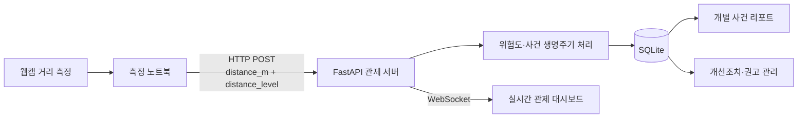
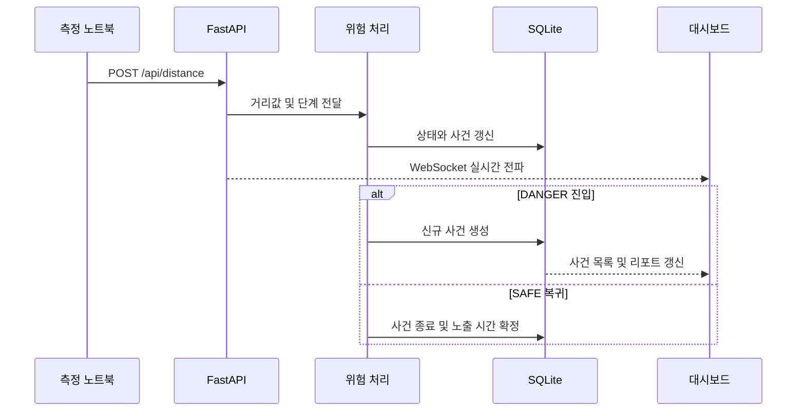

<div align="center">

# SafeON

### 실시간 산업현장 아차사고 예방 및 통합 안전 관제 MVP

웹캠 기반 측정 노트북에서 근로자와 지게차 사이의 거리 데이터를 받아<br>
위험 단계 판정, 사건 기록, 실시간 관제, 개별 리포트까지 연결합니다.

**🏆 2026학년도 건국대학교 Physical Engineering 창업 해커톤 대상(1위)**


[프로젝트 소개](#project-overview) ·
[시스템 구조](#system-architecture) ·
[기술적 의사결정](#engineering-decisions) ·
[실행 방법](#getting-started)

</div>

> [!NOTE]
> 🎬 실제 관제 화면 GIF는 `docs/assets/safeon-demo.gif`로 추가할 예정입니다.<br>
> 권장 장면: `SAFE → CAUTION → DANGER → 사건 생성 → 개별 리포트 → 개선조치`

## Project Overview

| 구분 | 내용 |
|---|---|
| 개발 기간 | 2026.07.19 ~ 2026.07.25 |
| 프로젝트 형태 | 5인 팀 창업 해커톤 MVP |
| 해결 과제 | 근로자와 지게차의 접근 위험을 실시간으로 파악하고 사건 단위로 추적 |
| 최종 시연 방식 | 거리 측정 노트북 → 관제 노트북 HTTP 통신 |
| 개인 기여 | FastAPI 관제 서버, WebSocket, SQLite, 위험 사건 관리, 대시보드 및 시스템 통합 |
| 주요 결과 | 해커톤 대상(1위), 자동 테스트 23개 통과 |

## Problem

산업현장에서는 근로자와 지게차가 가까워지는 순간을 감지하더라도 해당 위험이
언제 시작되고 얼마나 지속됐는지, 최소 접근거리가 얼마였는지 일관되게 기록하고
관리하기 어렵습니다.

또한 거리 측정 결과가 단순 경보로 끝나면 안전관리자는 발생한 사건을 검토하고
후속 조치를 추적하기 어렵습니다.

SafeON은 거리 신호를 다음과 같은 **안전관리 흐름**으로 전환합니다.

1. 거리 데이터 수신 및 3단계 위험 판정
2. `DANGER` 진입 시 위험 사건 자동 생성
3. 위험 지속 시간과 최소 접근거리 기록
4. WebSocket 기반 실시간 대시보드 전파
5. 개별 사건 리포트와 개선조치 관리

## Final Demo

최종 해커톤 시연에서는 ESP32와 UWB 센서를 사용하는 대신 웹캠으로
거리를 측정하는 노트북과 관제 노트북을 분리하고, 두 노트북이 같은 네트워크에서
HTTP로 통신하도록 구성했습니다.

```text
거리 측정 노트북
    └─ distance_m + distance_level
                  │
                  │ HTTP POST
                  ▼
관제 노트북
    ├─ FastAPI 수신 서버
    ├─ 위험 사건 처리
    ├─ SQLite 기록
    └─ WebSocket 실시간 대시보드
```

관제 서버에 전달되는 실제 데이터 계약은 두 필드로 제한했습니다.

```json
{
  "distance_m": 0.82,
  "distance_level": "DANGER"
}
```

`distance_level`은 `SAFE`, `CAUTION`, `DANGER` 중 하나이며, 서버는 계약에
없는 추가 필드가 포함된 요청을 거절합니다.

## System Architecture



### 주요 데이터 흐름



## Key Features

### 1. 실시간 거리 관제

- WebSocket을 통한 거리 및 위험 단계 실시간 업데이트
- `SAFE`, `CAUTION`, `DANGER` 단계별 시각적 구분
- 통신이 종료되면 대시보드 자동 재연결


### 2. 위험 사건 생명주기 관리

- `DANGER` 진입 시 사건 자동 생성
- 위험 지속 중 최소 접근거리와 노출 시간 갱신
- 안전 단계 복귀 시 진행 중인 사건 종료
- 사건 상태를 `OPEN`, `ACK`, `CLOSED`로 관리


### 3. 개별 사건 리포트

- 사건 ID 기반 상세 조회
- 시작·종료 시각과 위험 지속 시간
- 최소 접근거리와 위험 단계
- 당시 환경 정보와 조치 상태


### 4. 개선조치 관리

- 사건별 개선권고 생성
- 담당자, 기한, 우선순위와 진행 상태 관리
- 권고 승인 여부 기록
- 사건 내역 CSV 다운로드


## Hardware Prototype & Technical Pivot

초기에는 ESP32와 UWB 센서를 이용해 근로자와 지게차 사이의 거리를 측정하고,
측정 결과를 관제 서버로 전송하는 구조를 계획했습니다.

하지만 해커톤 현장에서 센서 측정과 ESP32 통신을 끝까지 안정화하지 못했습니다.
제한된 시간 안에 핵심 안전관리 시나리오를 검증하기 위해 측정 계층과 관제 계층을
분리하고, **노트북 간 HTTP 통신**으로 최종 경로를 전환했습니다.

| 구성 | 상태 | 최종 시연 사용 여부 |
|---|---|---|
| ESP32 기반 송신 | 실험용 송신 코드 작성, 현장 통합 미완료 | 미사용 |
| UWB 거리 측정 | 하드웨어 프로토타입 시도, 안정화 미완료 | 미사용 |
| 노트북 간 HTTP 통신 | 구현 및 통합 완료 | 사용 |
| FastAPI 관제 서버 | 구현 및 통합 완료 | 사용 |
| WebSocket 대시보드 | 구현 및 통합 완료 | 사용 |

### Hardware Photos

| 초기 ESP32·UWB 프로토타입 | 최종 노트북 간 통신 구성 |
|---|---|
|||

## Engineering Decisions

### 1. MQTT·ESP32 구조에서 노트북 간 HTTP로 전환

초기에는 MQTT 브로커와 ESP32를 포함한 구조를 검토했습니다. 그러나 짧은 개발
기간과 해커톤 현장에서는 센서, 펌웨어, 브로커, 네트워크를 동시에 안정화해야
했습니다.

최종 시연에서는 브로커 의존성을 제거하고 두 개의 입력 필드만 전송하는 HTTP
계약을 선택했습니다. 이를 통해 하드웨어 통합 실패가 관제 소프트웨어 전체의
실패로 이어지지 않도록 범위를 조정했습니다.

### 2. 순간 거리값이 아닌 ‘사건’을 저장

현재 거리값만 표시하면 위험의 시작과 종료, 지속 시간, 최소 접근거리를 파악하기
어렵습니다. 따라서 `DANGER` 진입부터 안전 단계 복귀까지를 하나의 사건으로
모델링했습니다.

### 3. 엄격한 하드웨어 통신 계약

하드웨어팀과 관제팀 사이의 인터페이스를 `distance_m`, `distance_level` 두
필드로 제한했습니다. Python 송신기, JSON Schema, ESP32 실험 코드가 동일한
형식을 사용하도록 구성했으며, Pydantic으로 잘못된 단계와 추가 필드를
거절합니다.

### 4. 시연 재현성을 위한 결정적 시뮬레이터

하드웨어 연결 여부와 무관하게 대시보드와 사건 처리 로직을 검증할 수 있도록
동일한 30초 시나리오를 반복 실행할 수 있게 했습니다.

## Validation

Python 표준 `unittest`로 다음 항목을 검증합니다.

- 거리 경계값별 위험 단계 판정
- 허용되지 않은 거리 단계와 추가 입력 필드 거절
- `DANGER` 사건 생성·갱신·종료
- 사건별 개선권고 중복 생성 방지
- 기존 SQLite 스키마 마이그레이션
- 30초 시나리오의 단계 노출과 연속성
- 개별 사건 리포트와 환경 정보 연결

```text
Ran 23 tests

OK
```

```powershell
.\.venv\Scripts\python.exe -m unittest -v
```

## Tech Stack

### Final Demo

| 기술 | 사용 목적 |
|---|---|
| Python | 관제 서버, 데이터 처리, 시뮬레이터 |
| FastAPI | 거리 수집 API와 관제 API |
| Pydantic | 두 필드 입력 계약 검증 |
| WebSocket | 대시보드 실시간 업데이트 |
| SQLite | 사건·장치·개선조치 저장 |
| HTML/CSS/JavaScript | 관제 대시보드 |
| unittest | 위험 로직과 통합 흐름 검증 |

### Explored Prototype

| 기술 | 상태 |
|---|---|
| ESP32 | Wi-Fi HTTP 송신 실험 코드 작성, 최종 현장 시연 미사용 |
| UWB | 거리 측정 프로토타입 시도, 최종 통합 미완료 |
| MQTT | 초기 통신 구조 검토 후 최종 시연 경로에서 제외 |

## Team

SafeON은 기획, 하드웨어, 거리 측정, 관제 소프트웨어, 비즈니스 모델을 나누어
진행한 5인 팀 프로젝트입니다.

| 이름 | 담당 역할 |
|---|---|
| 이승환 | PM: 프로젝트 운영 및 IR |
| 김수영 | 관제 소프트웨어 UI 설계 및 개발 |
| 민동연 | 안전관제 시스템 구현 및 시스템 통합 |
| 이윤민 | HW 구현, 거리 인식 알고리즘 |
| 하은지 | 근로자 태그 및 중장비 HW 구현 |

## Award

### 🏆 대상(1위)

- 대회: 2026학년도 건국대학교 Physical Engineering 창업 해커톤
- 수상일: 2026년 7월 25일
- 팀명: SafeON
- 수여: 건국대학교 창업지원본부


## Limitations & Next Steps

현재 버전은 해커톤 MVP이며 다음과 같은 제한이 있습니다.

- ESP32·UWB 하드웨어를 최종 시연에 통합하지 못함
- 근로자·장비 ID와 일부 환경 정보에 목업값 사용
- 로컬 네트워크와 단일 SQLite 데이터베이스 기반
- 사용자 인증과 현장별 권한 분리 미구현
- 실제 사고 데이터가 아닌 규칙 기반 위험평가와 개선권고 사용

향후 개선 방향은 다음과 같습니다.

- UWB 거리 측정 안정화 및 실제 하드웨어 통합
- 센서 연결 실패 시 재시도·오프라인 버퍼링 설계
- 다중 현장·다중 장치 지원
- 사용자 인증과 관리자 권한 분리
- 실제 현장 데이터 기반 위험 기준 검증

## Getting Started

### 1. Install

```powershell
.\.venv\Scripts\python.exe -m pip install -r requirements.txt
```

### 2. Run Control Server

```powershell
.\.venv\Scripts\python.exe -m uvicorn main:app --host 0.0.0.0 --port 8000
```

같은 노트북에서는 `http://127.0.0.1:8000`을 엽니다. 다른 노트북에서
접속하려면 관제 노트북의 IPv4 주소를 확인한 뒤
`http://관제노트북IP:8000`으로 접속합니다.

### 3. Send One Distance Packet

```powershell
.\.venv\Scripts\python.exe distance_sender.py 0.82 DANGER
```

다른 노트북의 관제 서버로 전송하려면:

```powershell
.\.venv\Scripts\python.exe distance_sender.py 0.82 DANGER --server http://192.168.0.10:8000
```

### 4. Run 30-Second Demo

```powershell
.\.venv\Scripts\python.exe simulator.py
```

### 5. Open

- Dashboard: `http://127.0.0.1:8000`
- API Documentation: `http://127.0.0.1:8000/docs`
- Health Check: `http://127.0.0.1:8000/api/health`

## Main API

| Method | Endpoint | Description |
|---|---|---|
| `POST` | `/api/distance` | 거리값과 거리단계 수신 |
| `GET` | `/api/live` | 대시보드 최신 상태 |
| `GET` | `/api/incidents` | 위험 사건 목록 |
| `GET` | `/api/incidents/{event_id}` | 개별 사건 리포트 |
| `PATCH` | `/api/incidents/{event_id}/action` | 사건 조치 상태 변경 |
| `GET` | `/api/report/daily` | 일일 안전 리포트 |
| `GET` | `/api/report/weekly` | 주간 안전 리포트 |
| `WS` | `/ws/live` | 실시간 관제 데이터 |

---

<div align="center">

**SafeON — 거리 신호를 실행 가능한 안전조치로**

</div>
